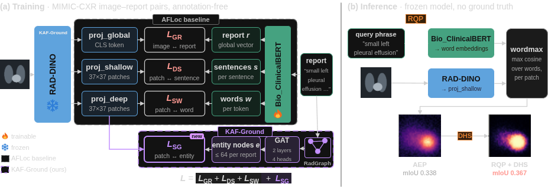
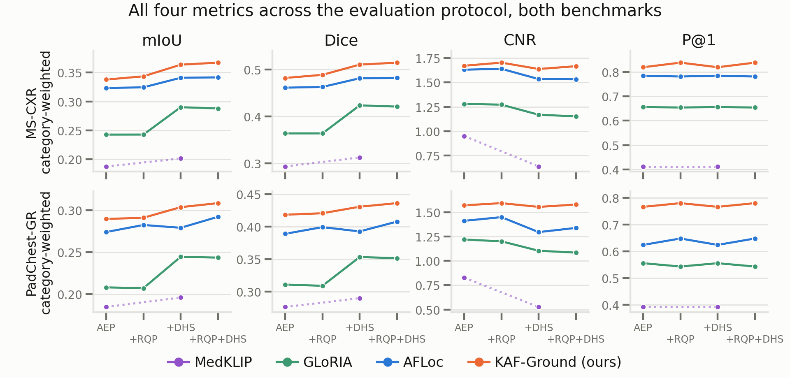

# KAF-Ground

Official code, results, and ablations for **Knowledge Graph-Guided Annotation-Free Phrase Grounding in Chest X-Ray Images** (KAF-Ground).

> Anonymous repository for double-blind review.




## Overview

Annotation-free phrase grounding localizes the image region described by a clinical phrase (e.g., *"small left pleural effusion"*) in a chest X-ray, using only paired images and radiology reports at training time. No boxes, masks, or class labels are used.

Existing annotation-free vision-language models have two limitations: (i) coarse spatial grids blur the boundaries between neighbouring anatomical regions, and (ii) models struggle to separate localizing content (findings and anatomical locations) from descriptive modifiers (severity, size, progression).

KAF-Ground builds on [AFLoc](https://doi.org/10.1038/s41551-025-01574-7) and addresses both:

1. **Dense visual features.** AFLoc's ResNet-50 is replaced by a frozen, chest X-ray-pretrained RAD-DINO (ViT-B/14), producing a dense 37 × 37 patch grid from a 518 × 518 image.
2. **Knowledge-graph alignment.** RadGraph parses of the training reports are encoded by a two-layer Graph Attention Network (GAT) over Bio_ClinicalBERT embeddings. A subgraph alignment loss `L_SG` (InfoNCE) aligns entity nodes with image patches, without region-level labels. Together with the AFLoc losses:

   `L = L_GR + L_DS + L_SW + L_SG`

3. **Two training-free inference refinements.**
   - **RadGraph Query Pruning (RQP):** removes non-localizing modifiers (e.g., *small*, *mild*) from the query using a lexicon built from MIMIC-CXR training reports (all MS-CXR studies excluded), e.g., "small left pleural effusion" becomes "left pleural effusion".
   - **Dynamic Heatmap Sharpening (DHS):** suppresses background with a steep sigmoid centred at `b = mean(u) + std(u)`, computed from each heatmap alone. It uses no ground truth, is a monotonic transform (peak locations and P@1 are unchanged), and its parameters are fixed across all models and benchmarks.

## Main results

Performance under the AFLoc Evaluation Protocol (AEP), i.e., **without** inference refinements. 95% paired-bootstrap confidence intervals (1,000 replicates).

**MS-CXR (1,162 image-phrase pairs)**

| Model | mIoU | Dice | CNR | P@1 |
|---|---|---|---|---|
| MedKLIP | 0.187 | 0.294 | 0.952 | 0.412 |
| GLoRIA | 0.242 | 0.364 | 1.280 | 0.656 |
| AFLoc | 0.323 | 0.461 | 1.631 | 0.784 |
| **KAF-Ground** | **0.338** | **0.482** | **1.672** | **0.819** |

**PadChest-GR (530 pairs, zero-shot transfer)**

| Model | mIoU | Dice | CNR | P@1 |
|---|---|---|---|---|
| MedKLIP | 0.185 | 0.276 | 0.828 | 0.392 |
| GLoRIA | 0.208 | 0.311 | 1.220 | 0.556 |
| AFLoc | 0.274 | 0.389 | 1.412 | 0.624 |
| **KAF-Ground** | **0.289** | **0.418** | **1.572** | **0.766** |

**With inference refinements (mIoU)**

| | MS-CXR | PadChest-GR |
|---|---|---|
| KAF-Ground (AEP) | 0.338 | 0.289 |
| + RQP | +1.7% | +0.5% |
| + DHS | +7.6% | +4.8% |
| + RQP + DHS | **0.367** (+8.7%) | **0.308** (+6.5%) |

### Ablation (MS-CXR, mIoU)

| Visual backbone | `L_SG` | mIoU |
|---|---|---|
| ResNet-50 (AFLoc) | no | 0.323 |
| ResNet-50 | yes | 0.330 |
| RAD-DINO | no | 0.332 |
| RAD-DINO | yes | 0.338 |

`L_SG` contributes a consistent gain of about +0.006 mIoU on both backbones.

### Failure recovery (AFLoc IoU = 0)

| Benchmark | AFLoc failures | Recovered | New failures | Remaining | McNemar p |
|---|---|---|---|---|---|
| MS-CXR | 63 | 59 | 1 | 5 | < 1e-15 |
| PadChest-GR | 30 | 28 | 3 | 5 | 4.6e-6 |

Per finding on MS-CXR, KAF-Ground achieves the highest IoU on 6 of 8 categories and ties AFLoc on pneumonia. The largest gains are on pneumothorax (+0.055) and edema (+0.031). The exception is cardiomegaly (−0.050).

Complete tables (every model at every stage, per finding type, bootstrap intervals) are in
[`results/ms-cxr/summary.md`](results/ms-cxr/summary.md),
[`results/padchest-gr/summary.md`](results/padchest-gr/summary.md), and
[`results/ablations/`](results/ablations/README.md).

## Repository structure

```
afloc/                 Training code (AFLoc code base + RAD-DINO encoder + RadGraph GAT and L_SG)
  models/              rad_dino_encoder.py, dual_stream_text.py (GAT), losses.py, afloc_model.py
  knowledge/           radgraph_injector.py (entity graphs), kg_sentence_builder.py (ablation)
  lightning/           training loop
kafground/             Evaluation and inference
  eval/                MS-CXR and PadChest-GR loaders, metrics
  inference/           engine.py (heatmaps), rqp.py + rqp_modifiers.txt, dhs.py
baselines/             GLoRIA and MedKLIP adapters
configs/               kaf_ground.yaml, ablations/
scripts/               dump_heatmaps, score_heatmaps, summarize_results,
                       check_paper_numbers, make_figures, build_rqp_lexicon
data/                  Dataset preparation (no data is distributed)
results/               Per-sample scores, tables, ablations
figures/               Paper figures (pipeline source in figures/source)
train.py
```

## Installation

```bash
conda create -n kafground python=3.9 && conda activate kafground
pip install -r requirements.txt
```

RAD-DINO (`microsoft/rad-dino`) and Bio_ClinicalBERT (`emilyalsentzer/Bio_ClinicalBERT`) are downloaded automatically from the Hugging Face Hub.

## Data

No data is distributed. Obtain the datasets from their official sources under their respective licenses, prepare them as described in [`data/README.md`](data/README.md), and set:

```bash
export KAF_MIMIC_IMG_DIR=...  KAF_MIMIC_CSV=...                 # training (MIMIC-CXR)
export KAF_MSCXR_JSON=...     KAF_MSCXR_IMG_DIR=...             # MS-CXR
export KAF_PADCHEST_DIR=...   KAF_PADCHEST_BENCH=...            # PadChest-GR
```

| Dataset | Use |
|---|---|
| MIMIC-CXR | Training (frontal image-report pairs, no box annotations) |
| RadGraph | Entity and relation graphs from the training reports |
| MS-CXR (1,162 pairs) | Evaluation. Boxes are never used for training or model selection |
| PadChest-GR (530 pairs) | Zero-shot evaluation (different institution, fully unseen) |

## Training

KAF-Ground is initialized from the released AFLoc checkpoint, from which only the text encoder is loaded. Set `train.load_ckpt` and `data.radgraph_path` in `configs/kaf_ground.yaml`, then run:

```bash
python train.py -c configs/kaf_ground.yaml --train --gpus 0,1 --val_check_interval 0.5
```

Setup: 2 GPUs (DDP), 64 images per GPU, Adam (lr 2e-5, StepLR with step 5 and gamma 0.5), 16-bit precision, seed 23. The RAD-DINO backbone is frozen. Bio_ClinicalBERT, its projection head, the three image heads, and the GAT (2 layers, 4 heads, at most 64 entity nodes per report) are trained. The checkpoints with the lowest MIMIC-CXR validation loss are kept.

## Evaluation

```bash
CKPT=checkpoints/kaf_ground.ckpt
for D in ms-cxr padchest-gr; do
  for R in off on; do
    python scripts/dump_heatmaps.py --model kaf-ground --ckpt $CKPT --dataset $D --rqp $R \
        --out runs/heatmaps/kaf-ground_${D}_rqp-$R.npy
    python scripts/score_heatmaps.py --dataset $D --heatmaps runs/heatmaps/kaf-ground_${D}_rqp-$R.npy \
        --out results/$D/persample/kaf-ground_rqp-$R.csv
  done
done
python scripts/summarize_results.py
python scripts/check_paper_numbers.py
```

`score_heatmaps.py` produces both DHS-off and DHS-on scores from a single heatmap dump. The AFLoc baseline uses `--model afloc` with the released AFLoc checkpoint. GLoRIA and MedKLIP are described in [`baselines/README.md`](baselines/README.md). A heatmap dump of MS-CXR requires about 1.2 GB.

**Protocol.** We follow the AFLoc Evaluation Protocol (AEP). Heatmaps are smoothed (Gaussian, sigma 1.5), upsampled to 518 × 518, and scored inside the central 453 × 453 region. mIoU and Dice are averaged over thresholds 0.1 to 0.5 on the map rescaled to [−1, 1]. CNR and pointing accuracy (P@1, whether the peak activation falls inside the ground-truth box) are also reported. All metrics are averaged within each finding category and then across categories. Confidence intervals come from 1,000 paired bootstrap replicates over image-phrase pairs (seed 0). All baselines are re-evaluated under identical settings.

## Reproducing the paper's numbers without a GPU

Per-sample scores of all models are included, so the tables, checks, and quantitative figures can be rebuilt directly:

```bash
python scripts/summarize_results.py     # results/*/tables, results/*/summary.md
python scripts/check_paper_numbers.py   # 150/150 checks pass
python scripts/make_figures.py          # figures/regenerated/ (identical to figures/)
```

## Limitations

- Training uses MIMIC-CXR only. Multi-institutional training is future work.
- Results are weaker on large, diffuse findings such as cardiomegaly, where a fine patch grid offers little benefit.
- The overall mIoU gain is modest, although consistent across backbones and benchmarks.
- RQP relies on a lexicon built from MIMIC-CXR reports, which likely explains its smaller gain on PadChest-GR.

## Checkpoint

The trained KAF-Ground checkpoint (1.7 GB) will be released after the review period.

## Citation

Citation details will be provided after the review period.

## Acknowledgements and license

The training code builds on the AFLoc code base and keeps its Apache-2.0 license (see `LICENSE`). We use RAD-DINO, Bio_ClinicalBERT, RadGraph, MIMIC-CXR, MS-CXR, and PadChest-GR under their respective licenses. GLoRIA and MedKLIP are evaluated with their official code and weights.
