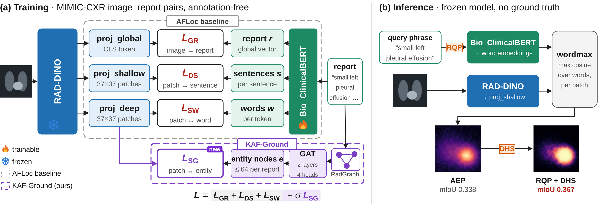

# KAF-Ground

Code, results and ablations for **KAF-Ground: annotation-free region retrieval in
chest X-rays with knowledge-graph semantics**.

KAF-Ground grounds a clinical phrase (*"small left pleural effusion"*) in a chest
X-ray without any box, mask or class label at training time. It builds on AFLoc
and changes three things:

1. **Fine-grained visual features.** AFLoc's ResNet-50 is replaced by a frozen
   RAD-DINO ViT-B/14, giving a 37 x 37 patch grid at 518 px.
2. **Knowledge-graph supervision.** RadGraph parses of the training reports pass
   through a 2-layer GAT, and a graph-supervised loss L_SG aligns entity nodes
   with image patches, next to AFLoc's report, sentence and word losses:
   `L = L_GR + L_DS + L_SW + sigma * L_SG` (sigma = 1).
3. **Two training-free inference rules.**
   *RadGraph Query Pruning (RQP)* drops qualifiers with no spatial meaning
   (*small*, *mild*, ...) using a lexicon derived once from RadGraph, and averages
   the maps of the original, pruned and templated query.
   *Dynamic Heatmap Sharpening (DHS)* sets each map's operating point from its
   own intensity distribution (a sigmoid around the (1 - q) quantile, where q is
   the fraction of pixels above mean + std).



## Main results

Category-weighted mIoU, 95% paired-bootstrap intervals. BEP = the model alone,
neither inference rule.

| | MS-CXR (1,162 pairs) | PadChest-GR (530 pairs, zero-shot) |
|---|---|---|
| MedKLIP | 0.1871 [0.179, 0.194] | 0.1847 [0.175, 0.195] |
| GLoRIA | 0.2424 [0.232, 0.252] | 0.2080 [0.196, 0.222] |
| AFLoc | 0.3232 [0.314, 0.332] | 0.2738 [0.260, 0.288] |
| KAF-Ground, BEP | 0.3379 [0.329, 0.347] | 0.2894 [0.276, 0.303] |
| KAF-Ground + RQP + DHS | **0.3672** [0.357, 0.377] | **0.3082** [0.294, 0.324] |

Full tables (Dice, CNR, pointing game, every model at every stage, per finding
type, complete failures) are in [`results/ms-cxr/summary.md`](results/ms-cxr/summary.md)
and [`results/padchest-gr/summary.md`](results/padchest-gr/summary.md); all
ablations are in [`results/ablations/`](results/ablations/README.md).

## Repository layout

```
afloc/                 training code (AFLoc code base + RAD-DINO encoder + RadGraph GAT / L_SG)
  models/              rad_dino_encoder.py, dual_stream_text.py (GAT), losses.py, afloc_model.py
  knowledge/           radgraph_injector.py (entity graphs), kg_sentence_builder.py (ablation)
  lightning/           training loop
kafground/             evaluation and inference
  eval/                MS-CXR and PadChest-GR loaders, metrics
  inference/           engine.py (heatmaps), rqp.py + rqp_modifiers.txt, dhs.py
baselines/             GLoRIA and MedKLIP adapters
configs/               kaf_ground.yaml, ablations/
scripts/               dump_heatmaps, score_heatmaps, summarize_results,
                       check_paper_numbers, make_figures, build_rqp_lexicon
data/                  dataset preparation (no data is distributed)
results/               per-sample scores, tables, ablations
figures/               the figures of the paper (pipeline source in figures/source)
train.py
```

## Setup

```bash
conda create -n kafground python=3.9 && conda activate kafground
pip install -r requirements.txt
```

Prepare the data as described in [`data/README.md`](data/README.md) and set:

```bash
export KAF_MIMIC_IMG_DIR=...  KAF_MIMIC_CSV=...                 # training
export KAF_MSCXR_JSON=...     KAF_MSCXR_IMG_DIR=...             # MS-CXR
export KAF_PADCHEST_DIR=...   KAF_PADCHEST_BENCH=...            # PadChest-GR
```

RAD-DINO (`microsoft/rad-dino`) and Bio_ClinicalBERT
(`emilyalsentzer/Bio_ClinicalBERT`) are downloaded from the HuggingFace hub.

## Training

KAF-Ground starts from the released AFLoc checkpoint, of which only the text
encoder is loaded. Set `train.load_ckpt` and `data.radgraph_path` in
`configs/kaf_ground.yaml`, then

```bash
python train.py -c configs/kaf_ground.yaml --train --gpus 0,1 --val_check_interval 0.5
```

Two GPUs with DDP, 64 images per GPU, Adam (lr 2e-5, StepLR 5 x 0.5), 16-bit,
seed 23. The RAD-DINO backbone is frozen; ClinicalBERT, its projection head,
the three image heads and the GAT are trained. Lightning keeps the
checkpoints with the lowest MIMIC-CXR validation loss.

## Evaluation

```bash
CKPT=checkpoints/kaf_ground.ckpt
for D in ms-cxr padchest-gr; do
  for R in off on; do
    python scripts/dump_heatmaps.py --model kaf-ground --ckpt $CKPT --dataset $D --rqp $R \
        --out runs/heatmaps/kaf-ground_${D}_rqp-$R.npy
    python scripts/score_heatmaps.py --dataset $D --heatmaps runs/heatmaps/kaf-ground_${D}_rqp-$R.npy \
        --out results/$D/persample/kaf-ground_rqp-$R.csv
  done
done
python scripts/summarize_results.py
python scripts/check_paper_numbers.py
```

`score_heatmaps.py` produces both the DHS-off and DHS-on scores from one dump.
The AFLoc baseline uses `--model afloc` with the released AFLoc checkpoint;
GLoRIA and MedKLIP are described in [`baselines/README.md`](baselines/README.md).
Each heatmap dump of MS-CXR takes about 1.2 GB.

Protocol details: heatmaps are smoothed (Gaussian, sigma 1.5), upsampled to
518 x 518 and scored inside the central 453 x 453 region (AFLoc's margin);
IoU and Dice are averaged over thresholds 0.1 to 0.5 on the map rescaled to
[-1, 1]; every reported number is the mean over finding types of the per-type
mean; intervals come from 1,000 paired bootstrap replicates over image-phrase
pairs (seed 0).

## Reproducing the paper's numbers without a GPU

The per-sample scores of every model are included, so the tables, the checks
and the quantitative figures can be rebuilt directly:

```bash
python scripts/summarize_results.py     # results/*/tables, results/*/summary.md
python scripts/check_paper_numbers.py   # 150/150 checks pass
python scripts/make_figures.py          # figures/regenerated/ (identical to figures/)
```

## Checkpoint

The trained KAF-Ground checkpoint (1.7 GB) will be linked here after the review
period.

## Acknowledgements and license

The training code builds on the AFLoc code base and keeps its Apache-2.0
license (`LICENSE`). We use RAD-DINO, Bio_ClinicalBERT, RadGraph, MS-CXR,
MIMIC-CXR and PadChest-GR under their respective licenses; GLoRIA and MedKLIP are
evaluated with their official code and weights.
